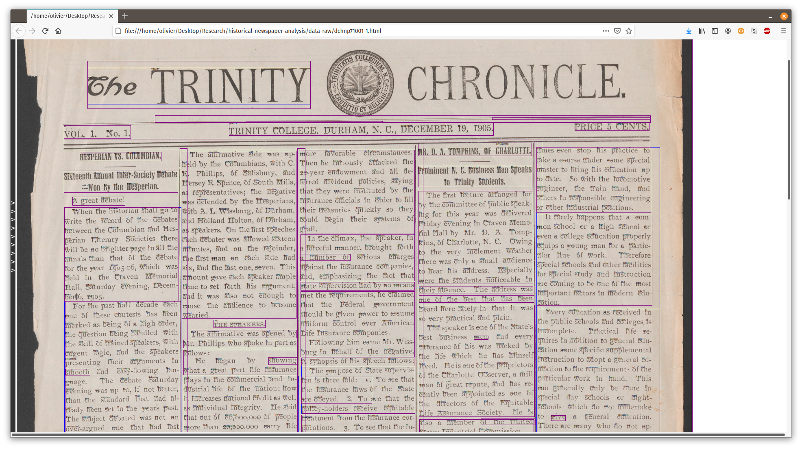

<!-- README.md is generated from README.Rmd. Please edit that file -->

```{r, include = FALSE}
library(TessTools)
knitr::opts_chunk$set(message=FALSE, warning=FALSE,
  collapse = TRUE,
  comment = "#>",
  fig.path = "man/figures/README-",
  out.width = "100%"
)
```

# TessTools: Tools for the use of Tesseract OCR in R


Interface to the Tesseract OCR command line tool (version 4) and parsing functions for the analysis of historical newspaper archives. This is under development.


## Installation

Make sure you have the [tesseract](https://github.com/tesseract-ocr/tesseract) command line program installed and available in PATH. You can either [Install Tesseract via pre-built binary package](https://tesseract-ocr.github.io/tessdoc/Home.html)
or [build it from source](https://tesseract-ocr.github.io/tessdoc/Compiling.html).

```bash
$ tesseract
Usage:
  tesseract --help | --help-extra | --version
  tesseract --list-langs
  tesseract imagename outputbase [options...] [configfile...]
```

You can install the development version of `TessTools` from [GitHub](https://github.com/) with:

``` r
# install.packages("devtools")
devtools::install_github("OlivierBinette/TessTools")
```
## Example

Run Tesseract OCR on newspaper scans. Extract paragraph text and bounding boxes:

```{r example, cache=TRUE}
library(TessTools)

# Run Tesseract OCR and get hocr output file paths.
# Newspaper scans from https://library.duke.edu/digitalcollections/dukechronicle_dchnp71001/
outputfiles = hocr_from_zip("data-raw/dchnp71001.zip", outputdir="data-raw/hocr", exdir="data-raw/img")

# Extract paragraph text
text = paragraphs(outputfiles)
tail(text[[1]]) # First page
```

Visualize the result using [hocrjs](https://github.com/kba/hocrjs):

```{r}
webpages = visualize_html(outputfiles, outputdir="data-raw/html") # webpage is at data-raw/html/dchnp71001-html
browseURL(webpages[[1]]) # Note: bring up the hocrjs menu and select "show background image"
```



## Ground truth

Paragraphs of the first issue have been annotated according to the article to which they belong.

```{r}
# Ground truth for first page
tail(vol1_paragraphs_truth[[1]])
```
